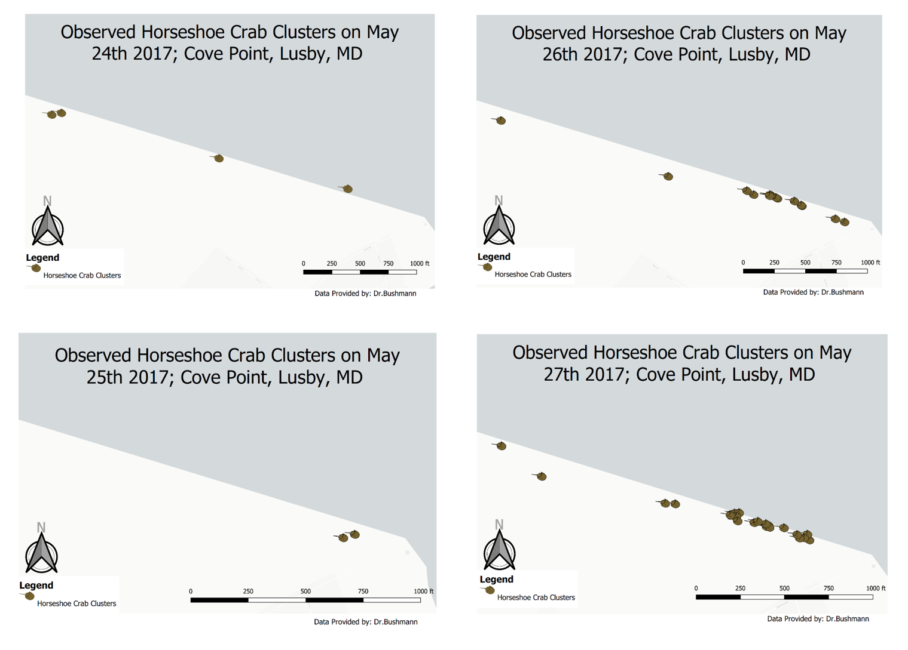

### Horseshoecrab Population Observations 
Description: While I was a student at Anne Arundel Community College, one of my professors was doing a study on horseshoe crab populations in the Chesapeake Bay. My service learning with this professor consisted of going to a private beach in Lusby MD with other students during high tides over the Summer. The data we collected was the total number of horseshoe crabs, the ratio of male to female, and the GPS coordinates. The aim of this project is to use the data that was collected to make a map that represents the clustering of horseshoe crabs during mating season. 
<>
Data: The data was provided by Dr.Bushmann, which was an excel file for each day that field work was completed in months May and June of 2017. Each ecxel file had the number of males and females, pictures, the time and date the picture was taken, latitude, and longitude. 
<>
Analysis: In ordered to determine where the horseshoecrabs clustered the most I use the Heatmap(Kernel Desnsity Estimation) tool. I also took advanatge of using the qgis2web to make a web map that displayed all of the points and pop-ups that displayed the number of males/females, total number of horseshoecrabs, and the latitude and longitude.
<>
Outputs: I made individual maps of where the horseshocrab clusters were found in each field survey, a heatmap for the density, and a webmap displaying the data provided in the excel sheets. 

### Horseshoecrab Density Heatmap

 
### [May & June 2017 Field Observations](/Fieldwork.md)

### [Web Map: Horseshoe Crab Field Observations May & June 2017](/NewWebMap/qgis2web_2020_04_19-15_30_31_588277)
